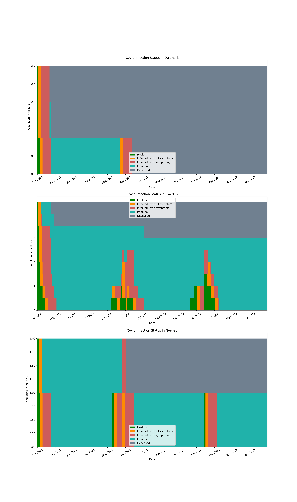

# Simulation of COVID-19 spread in specified countries

The purpose of the assignment was to simulate the spread of COVID-19 in some specified countries, using a set of data that were provided to me by a lecturer. For this matter, I had to create a sample population of people according to the data provided (sample ration is provided in the test.py - one sample per one million population). This was be done according to the age structure in each country (percentage of population in each age group).

Then for each individual in the sample I run a Markov Chain simulation for a specific period of steps (days). The Markov chain simulation considers 5 states (H,I,S,M,D). In this Markov chain, an individual begins in the state 'healthy (H)' and by some transition probability it changes state to 'infected without symptoms (I)', 'with symptoms (S)', 'deceased (D)', 'immunity by infection (M)' or even back to 'healthy (H)'.

At the end I accumulated data for each specified country and each date.

### Table 1: Benchmarks table for uninformed search.

| Level  | Strategy | States Generated | Time/s  | Solution length |
| ------ | -------- | ---------------- | ------- | --------------- |
| MAPF00 | BFS      | 49               | 0,119   | 14              |
| MAPF00 | DFS      | 42               | 0,081   | 18              |
| MAPF01 | BFS      | 2 351            | 2,543   | 14              |
| MAPF01 | DFS      | 1 271            | 0,271   | 147             |
| MAPF02 | BFS      | 110 446          | 80,246  | 14              |
| MAPF02 | DFS      | 8 219            | 0,331   | 207             |
| MAPF03 | BFS      | 473 691          | 179,979 | -               |
| MAPF03 | DFS      | 128 512          | 0,967   | 608             |
